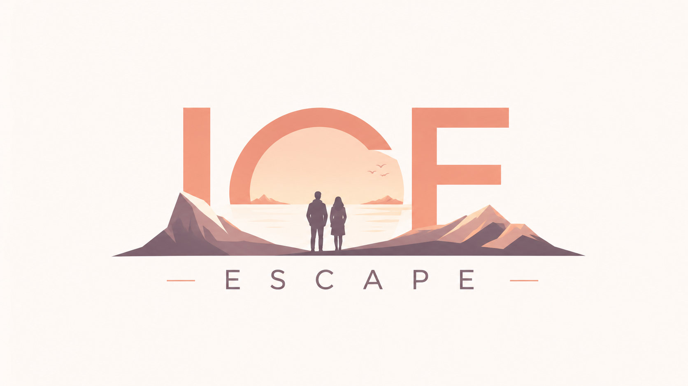

<p align="center">
  <a href="https://iceescape.bk4ice.live">
    
  </a>
</p>

<h1 align="center">IceEscape</h1>
<p align="center">A location scout map for photographers: coordinates, light, moon phase, all in one page.</p>

<p align="center">
  <a href="https://iceescape.bk4ice.live">
    
  </a>
  <a href="https://github.com/bk4ice/iceescape-docker/blob/main/LICENSE">
    
  </a>
  <a href="README.zh.md">🇨🇳 中文</a>
</p>

<p align="center">
  <a href="https://iceescape.bk4ice.live">🌐 Live Demo</a> ·
  <a href="docs/screenshot.png">📸 Screenshot</a> ·
  <a href="#quick-start">🚀 Quick Start</a>
</p>

---

## One-liner

When I see a great travel photo, I rarely care about the filter. What I want to know is:

> Where was this taken? What's the best light? Which focal length? Will the moon ruin the shot?

That info is usually buried in comments or missing entirely. IceEscape makes it simple:

**A location archive built for photographers.** Every spot includes coordinates, navigation, best shooting times, sunrise/sunset, blue/golden hour, moon phase and position, recommended focal length, and composition notes — all on one page.

I started this to help my wife organize travel photo spots. More and more friends started asking "where is this?", so I open-sourced it. Now you can run it with one Docker command.

<p align="center">
  
</p>

---

## What problem it solves

| The old way | With IceEscape |
|-------------|----------------|
| Asking "where is this?" in comments with no reply | Spot page shows coordinates and navigation |
| Photo collections grow but become unsearchable | Search by city, tag, or keyword |
| Arrive on location and the light is already gone | Auto sunrise, sunset, blue & golden hour times |
| Milky-way plans ruined by moonlight | Each spot shows moon phase, moonrise, and moonset |
| Bring the wrong lens | Focal length and composition notes are saved upfront |
| Building a city photo map means manual data entry | Bulk import from social photo posts |

---

## Key features

### 🌅 Light & moon planning

Not just pins on a map — IceEscape calculates the light data you actually need from each spot's coordinates:

- **Sunrise, sunset, blue & golden hour**: no more switching to third-party apps; open the page and know exactly when to be there.
- **Moon phase, moonrise & moonset**: plan Milky-way, moon-rise portraits, and city night shots without moonlight surprises.
- **Weather & shootability index**: local shooting-window guidance at a glance.

### 📍 Map + search

Browse every spot on a map, filter by city, tag, or keyword. Click through to a full spot profile.

### 📄 Everything on one page

Sample photo, coordinates, best times, focal length, composition tips, and notes — no more jumping between maps, notes, and albums.

### 🤖 AI assistant

Upload a sample photo and get suggested angle, focal length, and timing.

### 🛠️ Admin dashboard

Visit `/admin` to manage spots, users, and permissions.

### 📥 Bulk import

Turn social photo posts into structured spots without typing everything by hand.

### 🐳 One-command Docker deploy

Copy the config, fill in a few keys, run one command.

---

## Who is it for

- Photographers and travelers who love planning "where was this taken" trips
- Landscape shooters who need sunrise, sunset, Milky-way, and moon-rise planning
- Small teams building city, campus, or scenic spot photo maps
- Developers who need a ready-made "location + content + map" stack

---

## Quick start

### Requirements

- Docker 20.10+
- Docker Compose v2.0+
- At least 2 GB RAM / 5 GB disk
- Map service key and AI service key (see `.env.example`)

### 1. Clone & configure

```bash
git clone https://github.com/bk4ice/iceescape-docker.git
cd iceescape-docker
cp .env.example .env
# Fill in the required keys following .env.example
```

### 2. Start

```bash
docker compose up -d
```

Visit http://localhost:3000.

### 3. Production HTTPS deploy

```bash
mkdir -p ssl
cp your-cert.pem ssl/cert.pem
cp your-key.pem ssl/cert.key
# Set DOMAIN, SSL_CERT_PATH, SSL_KEY_PATH in .env
docker compose -f docker-compose.prod.yml up -d
```

---

## Demo

| Live Demo | Screenshot | Video |
|-----------|------------|-------|
| [iceescape.bk4ice.live](https://iceescape.bk4ice.live) | [docs/screenshot.png](docs/screenshot.png) | [docs/iceescape_demo.mp4](docs/iceescape_demo.mp4) |

<p align="center">
  <video src="docs/iceescape_demo.mp4" width="720" controls poster="docs/screenshot.png"></video>
</p>

---

## Current status

Live demo available, core workflows working, still under active improvement. Feedback and issues are welcome.

**Note**: Map and AI features require a map service key and an AI service key. See `.env.example` for details.

---

## FAQ

**Services won't start?**

```bash
docker compose logs -f
```

**Can't log into admin?**  
Make sure `ADMIN_PASSWORD` is set in `.env`.

**Map or AI features not working?**  
Check that the map key and AI key in `.env` are valid.

---

## Security tips

- Never commit `.env`, `ssl/`, `secrets/`, or real upload files to Git
- In production, only expose ports 80/443
- Back up the database and upload directories regularly
- Use strong passwords

---

## License

[MIT License](./LICENSE)
