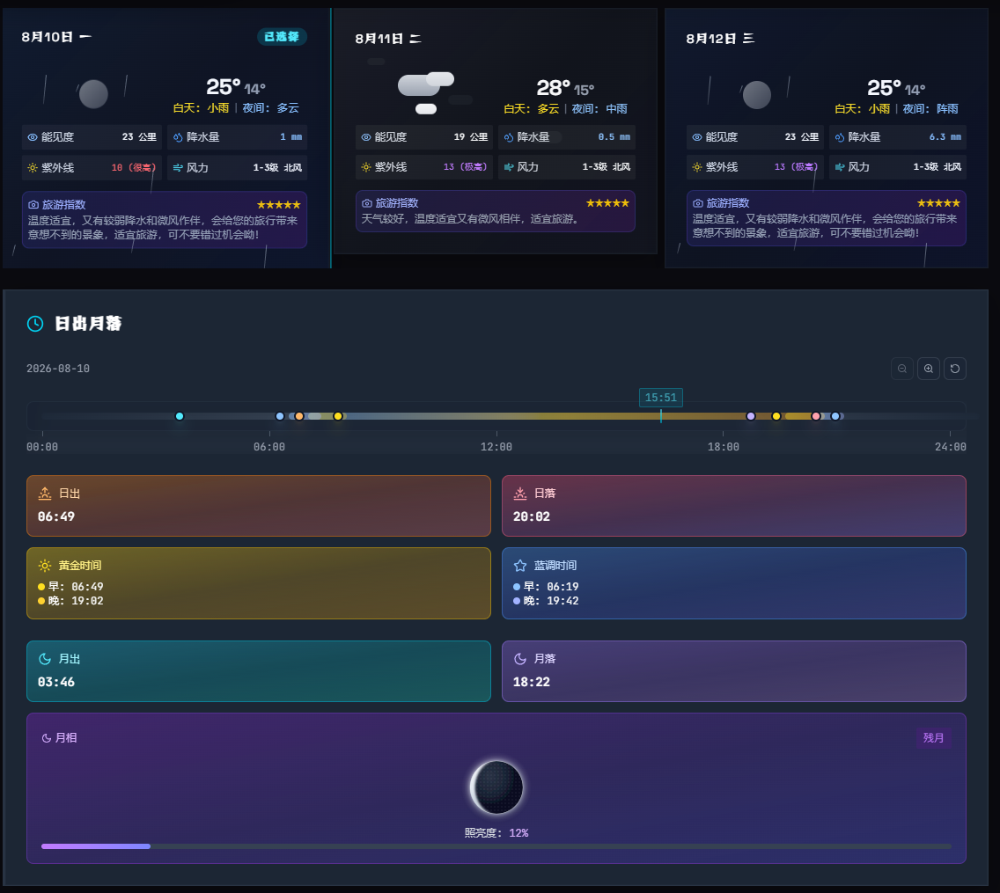

<p align="center">
  <a href="https://iceescape.bk4ice.live">
    
  </a>
</p>

<h1 align="center">IceEscape</h1>
<p align="center">摄影师的机位地图：坐标、光线、月相，一页查全</p>

<p align="center">
  <a href="https://iceescape.bk4ice.live">
    
  </a>
  <a href="https://github.com/bk4ice/iceescape-docker/blob/main/LICENSE">
    
  </a>
  <a href="README.md">🇺🇸 English</a>
</p>

<p align="center">
  <a href="#演示">🎬 演示</a> ·
  <a href="docs/screenshot.png">📸 截图</a> ·
  <a href="#快速开始">🚀 快速开始</a>
</p>

---

## 一句话介绍

刷到一张旅行照，我最想知道的从来不是滤镜，而是：这是在哪拍的？几点光线最好？带什么焦段？月亮会不会坏事？

**IceEscape 把“机位”做成可搜索、可收藏的地点档案**：坐标、导航、最佳拍摄时段、日出日落、蓝调黄金时刻、月相月升月落、推荐焦段、构图参考，一页看全。

这个项目本来是为了帮我老婆整理旅行打卡点。后来发现很多朋友都在问“这是哪拍的”，干脆开源了。现在用 Docker 一条命令就能跑起来。

<p align="center">
  
</p>

<p align="center">
  
</p>

---

## 它解决什么问题

| 以前的麻烦 | IceEscape 的做法 |
|------------|------------------|
| 在评论区问“这是哪”没人回 | 地点档案直接显示坐标和导航 |
| 收藏夹里照片堆成山，想找一张找不到 | 按城市、标签、关键词搜索 |
| 到现场才发现光线已经没了 | 自动计算日出、日落、蓝调、黄金时段 |
| 拍银河被月光毁掉 | 每个机位显示月相、月升月落时间和方位 |
| 出门才发现镜头带错 | 焦段、构图建议提前写进档案 |
| 团队整理城市打卡地图要手工录 | 支持批量导入结构化数据 |

---

## 核心亮点

### 🌅 光线与月相规划

不只是收藏地点，IceEscape 会根据机位坐标自动算出你真正需要的光线信息：

- **日出日落、蓝调与黄金时段**：不用再切出去查第三方 App，打开档案就知道几点到最合适。
- **月相、月升月落时间和方位**：拍银河、月升人像、城市夜景时，提前判断月光会不会干扰。
- **天气与拍摄指数**：结合位置给出当天拍摄窗口参考。

### 📍 地图 + 搜索

打开地图就看到所有收录机位，支持按城市、标签、关键词检索。点开是一份完整档案。

### 📄 一页看全

样片、坐标、最佳时段、焦段建议、构图参考、注意事项集中展示，不用在地图、笔记、相册之间来回跳。

### 🤖 AI 辅助

上传一张样片，自动给出拍摄角度、镜头焦段和推荐时间。

### 🛠️ 后台管理

访问 `/admin` 管理地点、用户和权限。

### 📥 批量导入

把社交平台上的图文素材整理成结构化地点，省去大量手工录入。

### 🐳 Docker 一键部署

复制配置、填 Key、一条命令启动。

---

## 适合谁

- 旅行前喜欢做“机位攻略”的摄影和旅行爱好者
- 拍日出日落、银河、月升人像，需要提前规划光线的风光摄影师
- 想整理城市、校园、景区打卡地图的小团队
- 需要“地点 + 内容 + 地图”方案的开发者

---

## 快速开始

### 环境要求

- Docker 20.10+
- Docker Compose v2.0+
- 至少 2 GB 内存 / 5 GB 磁盘空间
- 地图服务 Key 和 AI 服务 Key（见 `.env.example`）

### 1. 克隆并配置

```bash
git clone https://github.com/bk4ice/iceescape-docker.git
cd iceescape-docker
cp .env.example .env
# 按 .env.example 说明填写必填 Key
```

### 2. 启动

```bash
docker compose up -d
```

访问 http://localhost:3000。

### 3. 生产 HTTPS 部署

```bash
mkdir -p ssl
cp your-cert.pem ssl/cert.pem
cp your-key.pem ssl/cert.key
# 在 .env 中填写 DOMAIN、SSL_CERT_PATH、SSL_KEY_PATH
docker compose -f docker-compose.prod.yml up -d
```

---

## 演示

| 在线体验 | 截图 | 视频 |
|----------|------|------|
| [iceescape.bk4ice.live](https://iceescape.bk4ice.live) | [docs/screenshot.png](docs/screenshot.png) | [docs/iceescape_demo.mp4](docs/iceescape_demo.mp4) |

<p align="center">
  <video src="docs/iceescape_demo.mp4" width="720" controls poster="docs/screenshot.png"></video>
</p>

---

## 当前状态

可演示、可试用，核心流程已经跑通，但仍在持续优化中。欢迎体验，也欢迎 issue。

**注意**：地图、AI 建议等功能需要配置高德地图 Key 和 AI 服务 Key，详见 `.env.example`。

---

## 常见问题

**服务起不来？**

```bash
docker compose logs -f
```

**管理员无法登录？**  
检查 `.env` 中 `ADMIN_PASSWORD` 是否已设置。

**地图或 AI 建议不可用？**  
检查 `.env` 中的地图 Key 和 AI Key 是否有效。

---

## 安全建议

- 不要把 `.env`、`ssl/`、`secrets/` 里的真实文件提交到 Git
- 生产环境只开放 80/443 端口
- 定期备份数据库和上传目录
- 使用强密码

---

## 许可证

[MIT License](./LICENSE)
